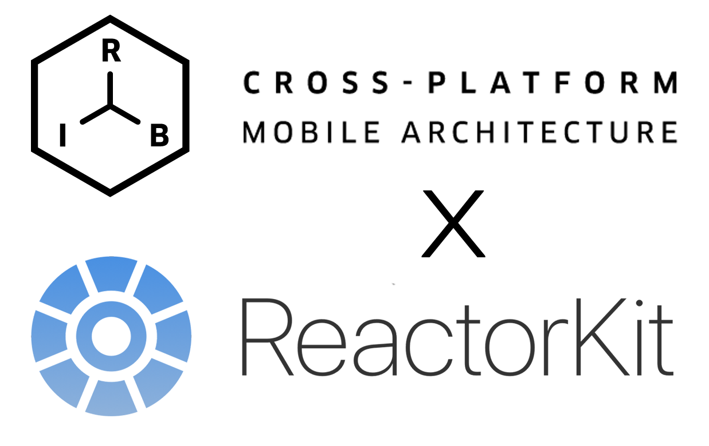
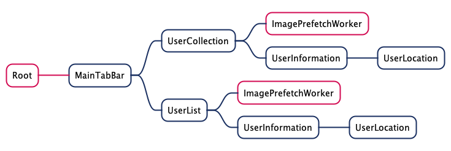

# RIBsReactorKit

Origin Source : https://github.com/ElonPark/RIBsReactorKit

Project Build가 되지 않아 수정함

[RIBs](https://github.com/uber/RIBs) X [ReactorKit](https://github.com/ReactorKit/ReactorKit) PoC



### RIB Tree


### Related post
- [medium](https://blog.mathpresso.com/ribs에-reactorkit-도입하기-6593124a34ec)

### install

Required Xcode 12.5 or above
```shell
$ make setup
```
